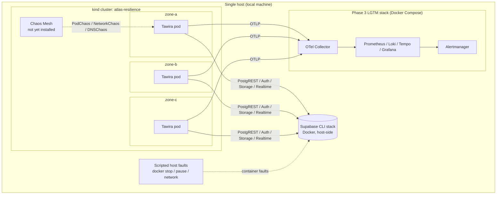

# Atlas Resilience

> Resilience engineering for the Atlas platform: failure injection, Game
> Days, and measured recovery against a real application, run locally at
> zero cost.

## Problem Statement

Systems are usually shown running and rarely shown failing. "Highly
available" is an assertion until someone kills a zone, partitions the
database, or expires a certificate and measures what happens. Atlas
Resilience does that deliberately. Each failure scenario is designed on
paper, injected into a real application on a local zone-labeled
Kubernetes cluster, observed through the Phase 3 observability stack, and
written up with measured detection and recovery times, whether or not the
system behaved the way the design said it would.

## A note on anonymization

The workload under test is Tawira, a production SaaS application I run,
not a sample app. Service names and other identifying details are
genericized (`atlas-demo-*`) because Tawira is private. Behavior,
timings, and defects reported here are real and unmodified. Everything
runs against a local Supabase instance, never against production data.
See [ADR-0003](docs/adr/ADR-0003-target-workload.md) for why a real
application was chosen, consistent with the same decision in
[`atlas-security`](https://github.com/spacecode-art/atlas-security) and
[`atlas-observability`](https://github.com/spacecode-art/atlas-observability).

## Overview

Atlas Resilience is Phase 5 of the Atlas platform. It runs Tawira on a
three-zone kind cluster, injects failures with Chaos Mesh and scripted
host-side faults, watches the results through the Phase 3 Golden Signals
stack, and produces runbooks, measured RTO/RPO, and blameless
postmortems. Defects found along the way are fixed with before/after
evidence.

---

## Objectives

- Seven failure scenarios (SC-01 to SC-07), each a vertical slice:
  design doc, chaos experiment, runbook, measured RTO/RPO, postmortem,
  all sharing one ID
- A real application on a three-zone local cluster, with replicas
  spread across zones
- Every experiment states its hypothesis, steady state, blast radius,
  and abort condition before it runs
- Detection time measured through the Phase 3 Golden Signals stack, not
  assumed
- Defects found by experiments fixed in the application with
  before/after evidence
- Every non-trivial decision recorded as an ADR, same discipline as the
  other Atlas repositories

---

## Failure Scenarios

| ID | Scenario | Method | Status |
|---|---|---|---|
| SC-01 | AZ failure | Stop or partition a zone-labeled kind worker; Tawira spread across zones | Planned |
| SC-02 | Database failure | Scripted container faults on host Supabase plus Chaos Mesh NetworkChaos on Tawira's egress | Planned |
| SC-03 | DNS failure | Chaos Mesh DNSChaos | Planned |
| SC-04 | Certificate expiration | cert-manager short-lived certificates left to lapse | Planned |
| SC-05 | IAM compromise | Tabletop exercise; revoke/rotate steps rehearsed against MiniStack | Planned |
| SC-06 | Secrets leak | Tabletop exercise; Gitleaks detection and rotation drill | Planned |
| SC-07 | Third-party dependency failure (email, payments) | NetworkChaos on egress to each provider | Planned |

Not every scenario maps to a chaos tool, and this repo says so rather
than pretending otherwise. SC-05 and SC-06 are tabletop exercises. Zones
are node labels on one machine, not independent fault domains, so loss
of the database's own zone cannot be simulated (see
[ADR-0001](docs/adr/ADR-0001-local-kind-cluster-as-failure-domain.md)).

---

## Architecture Diagram



---

## Repository Structure

```text
atlas-resilience/
├── .github/
│   ├── workflows/
│   │   └── ci.yml                 # secrets scan via atlas-security
│   └── dependabot.yml
├── cluster/
│   └── kind-config.yaml           # 1 control plane + 3 zone-labeled workers
├── target/
│   └── tawira/
│       ├── tawira.yaml            # Deployment (3 replicas, zone spread) + Service
│       └── .env.example
├── chaos/                         # (not yet built) Chaos Mesh install + experiment CRDs
├── measurements/                  # (not yet built) RTO/RPO scripts and results
├── scripts/                       # (not yet built) scripted host-side faults
├── terraform/                     # (not yet built) AWS reference design, plan-only
├── docs/
│   ├── adr/                       # Architecture Decision Records
│   ├── evidence/
│   │   └── spike/                 # S1 and S5 spike evidence
│   ├── scenarios/                 # (not yet written) one doc per SC-ID
│   ├── runbooks/                  # (not yet written) one runbook per SC-ID
│   ├── gameday/                   # (not yet built) plan, timeline, roles
│   ├── postmortems/               # (not yet built) blameless postmortems
│   ├── architecture/              # (not yet written) failure domains, overview
│   ├── threat-model.md            # (not yet written)
│   ├── cost-model.md              # (not yet written)
│   └── slo-rto-rpo.md             # (not yet written)
├── .editorconfig
├── .gitignore
├── CHANGELOG.md
├── CONTRIBUTING.md
├── LICENSE
└── README.md
```

---

## Technology Choices

| Choice | Why this, not the alternative |
|---|---|
| **kind (3 zone-labeled workers)** over live EKS | Chaos experiments are repeated and iterated on; burst-deploying cloud infrastructure for each one costs money and time. The Kubernetes API surface exercised is the same. See [ADR-0001](docs/adr/ADR-0001-local-kind-cluster-as-failure-domain.md). |
| **Chaos Mesh plus scripted host faults** over a single tool | Chaos Mesh gives declarative, reviewable CRDs for in-cluster faults but cannot reach host-side containers. Scripts cover only what it cannot, and each states why. See [ADR-0002](docs/adr/ADR-0002-chaos-tooling.md). |
| **Tawira (real app)** over a purpose-built sample | A real application produces real findings. A fallback to a minimal app is defined in ADR-0003 if the environment spike fails. |
| **Supabase CLI stack on the host** over Supabase manifests on kind | Tawira uses Postgres/PostgREST, Auth, Storage, and Realtime. Reproducing four services on kind adds plumbing without improving the resilience evidence. |
| **Phase 3 LGTM stack** over a new observability setup | Detection time should be measured with the stack already built, which also exercises it against a containerized workload. |
| **Locally built, unsigned image** over the signed CI image | The CI image bakes in a browser-facing Supabase URL that cannot point at a local backend. The local image sits outside the Phase 2 signing chain, and this is stated, not hidden. |

---

## Deployment Guide

**Prerequisites:** Docker, `kind`, `kubectl`, Node (for `npx supabase`),
a Tawira checkout, and the `atlas-observability` stack running. Scripted
bring-up (`up.sh`) is deliberately deferred until the manual flow is
proven by the spike.

```bash
# 1. Supabase (in the Tawira checkout). Note the publishable and secret keys.
npx supabase start
npx supabase status

# 2. Cluster (in this repo)
kind create cluster --config cluster/kind-config.yaml
kubectl get nodes -L topology.kubernetes.io/zone
docker network inspect kind -f '{{range .IPAM.Config}}{{.Gateway}} {{end}}'
# The IPv4 value is <GATEWAY>: the host as the pods see it.

# 3. Image (in the Tawira checkout). VITE_* is read by the BROWSER, so 127.0.0.1.
export SB_PUB='<publishable key>'
docker build -t tawira:chaos-local \
  --build-arg VITE_SUPABASE_URL=http://127.0.0.1:54321 \
  --build-arg VITE_SUPABASE_PUBLISHABLE_KEY="$SB_PUB" \
  --build-arg VITE_SITE_URL=http://127.0.0.1:3000 .
kind load docker-image tawira:chaos-local --name atlas-resilience

# 4. Deploy (in this repo)
cp target/tawira/.env.example target/tawira/.env   # fill in <GATEWAY> and keys
kubectl apply -f target/tawira/tawira.yaml
kubectl -n tawira create secret generic tawira-env --from-env-file=target/tawira/.env
kubectl -n tawira rollout restart deploy/tawira
kubectl -n tawira get pods -o wide
```

The first `apply` creates pods before the secret exists, so they error
until the `rollout restart` picks it up. Expected, not a fault.

---

## Current Status

**Built:**
- ADR-0001 to ADR-0003. ADR-0003 is **Proposed** and stays so until
  every spike criterion is evidenced
- Three-zone kind cluster (Kubernetes v1.37.0 node image): one control
  plane and three workers carrying `zone-a`/`zone-b`/`zone-c` labels,
  confirmed with `kubectl get nodes -L topology.kubernetes.io/zone`
- Tawira built locally from its Dockerfile, loaded into the cluster,
  and running as three replicas, one per zone (spike S1, S5; evidence in
  [`docs/evidence/spike/`](docs/evidence/spike/))

**Not yet built, tracked honestly:**
- Spike S2 (login end to end against host Supabase), S3 (traces from
  the pod reach the Collector), S4 (resource headroom with every stack
  running at once)
- Chaos Mesh installation, every experiment, runbook, and measured
  RTO/RPO result
- A Tawira health endpoint (readiness is currently a TCP probe on the
  port, which proves the process started, not that the app works)
- The AWS reference design, threat model, Game Day, and demo video

---

## Findings So Far

**Rolling update broke the zone spread (spike S5).** The first deploy
used `topologySpreadConstraints` with `maxSkew: 1`, yet pods landed
2/1/0 across the three zones, which `maxSkew: 1` should prevent
([evidence](docs/evidence/spike/s5-before.txt)). The likely cause is that
old and new ReplicaSet pods share the same label, so the scheduler
counted pods that were about to terminate. Adding
`matchLabelKeys: [pod-template-hash]` produced a 1/1/1 spread on the
next rollout ([evidence](docs/evidence/spike/s5-after.txt)).

Caveats: the cause is a hypothesis that was not isolated further, and
the fix was verified in a single run. It matters for SC-01 because a
routine deploy could otherwise silently undo the zone spread the
experiment relies on.

---

## Cost Model

**$0 spent.** kind, Chaos Mesh, Supabase CLI, and the Phase 3 stack are
free and open-source and run on one local machine. No cloud resource is
created by this repo.

---

## Design Decisions (ADRs)

| ADR | Decision | Status |
|---|---|---|
| 0001 | Local kind cluster as the failure domain | Accepted |
| 0002 | Chaos Mesh for in-cluster faults, scripted host faults for the rest | Accepted |
| 0003 | Tawira on kind, Supabase CLI stack on the host | Proposed (pending spike S2-S4) |

---

## Testing Strategy

Nothing here is marked done because a manifest applied cleanly. The S5
finding is the proof of why: the manifest looked correct and the
placement was wrong, and only observing the running cluster showed it.

- **Experiment template.** Every scenario states hypothesis, steady
  state (measured from the Phase 3 Golden Signals), blast radius,
  abort condition, result, and follow-up before it runs.
- **Observed, not assumed.** A result comes from running the
  experiment and capturing output into `docs/evidence/`, not from
  reading configuration.
- **Environment labeling.** Every measurement names the environment it
  came from. Local-cluster numbers show the application's and
  automation's behavior, not AWS service timings.
- **Run counts.** A single run is an observation. A result states how
  many runs it rests on.
- **What the local environment cannot test** is documented per scenario
  rather than omitted.

---

## Monitoring

Detection is measured with the [`atlas-observability`](https://github.com/spacecode-art/atlas-observability)
stack. The following comes from static reading of its alert rules and
**has not been tested**. SC-02 exists in part to confirm or refute it:

- **Possible total-outage blind spot.** `HighErrorRate` divides the 5xx
  rate by total request rate, so if the application dies and no series
  exist, the expression may return nothing and never fire. `TargetDown`
  watches scrape targets, and Prometheus may only be scraping the
  Collector, not the application.
- **Detection-time floor.** With 15s scrape and evaluation intervals, a
  `for: 5m` clause, and Alertmanager's `group_wait`, best-case
  time-to-detect for the error-rate alert is roughly 5.5 to 6 minutes.
  Game Day numbers are reported against that baseline.

---

## Threat Model

Full STRIDE analysis: not yet written (`docs/threat-model.md`). Risks
already known from this repo's own setup:

| Finding | Category | Status |
|---|---|---|
| Chaos Mesh holds powerful cluster permissions and ships a dashboard | Elevation of Privilege | Mitigation specified in ADR-0002: pinned version, dashboard not exposed beyond localhost |
| The Supabase CLI stack binds all services to `0.0.0.0`, and Studio and pgMeta have no authentication (stated in the CLI's own output) | Information Disclosure | Accepted risk for local-only use; run on a trusted network or firewall ports 54321-54324 |
| The local image is built outside the Phase 2 signing chain | Tampering | Stated in ADR-0003; image is never pushed |
| Supabase and Brevo/Paystack credentials needed to run the target | Information Disclosure | `.env` is gitignored; secrets enter the cluster via a Kubernetes Secret created from the local file |

---

## Incident Runbook

Not yet written. One runbook per scenario ID will live in
`docs/runbooks/`, each mapped to a real experiment and an alert (or an
explicit statement that no alert covers it), not generic filler.

---

## CI/CD

[`.github/workflows/ci.yml`](.github/workflows/ci.yml) runs on every PR
and push to `main`. Currently a single job: secrets scanning via
`atlas-security`'s reusable `reusable-secrets-scan.yml` (pinned to
`v1.0.4`), consuming the Phase 2 tooling rather than duplicating it.
Dependabot tracks GitHub Actions.

**Deliberately not yet in CI:** manifest validation, YAML linting, and
`terraform validate`/`plan` for the AWS reference design. Those come
with the content they validate. The experiments themselves are
run by hand and are not CI-gated by design.

---

## Security Review

- **Secrets scanning** is enforced in CI on every PR.
- **Dockerfile build warnings.** BuildKit flags `SecretsUsedInArgOrEnv`
  for `VITE_SUPABASE_PUBLISHABLE_KEY`. This is a name-pattern match on
  a key that is public by design: `VITE_*` values are embedded in the
  browser bundle, and the Dockerfile states that server-only secrets
  must never be passed as build arguments.
- **No SAST/dependency scanning of Tawira here.** It is scanned in
  `atlas-security`; this repo deploys it and adds only manifests.

---

## Cost Analysis

The AWS-equivalent design (multi-AZ database, per-AZ NAT per
`atlas-network` ADR-0004) is planned as a plan-only Terraform reference
reusing `atlas-foundation`'s database module. Its cost model is not yet
written, and no dollar figures are claimed until they are sourced from
current AWS pricing.

---

## Postmortem Example

No Game Day has been run yet. The first blameless postmortem will live
in `docs/postmortems/`. The only incident-style finding so far is the
zone-spread skew documented under Findings So Far.

---

## Future Roadmap

- Complete spike S2 to S4, then move ADR-0003 to Accepted, or to a
  fallback if the environment cannot hold the workload
- ADR for a Tawira health endpoint (liveness should not depend on the
  database, or a database outage restarts every pod)
- Install Chaos Mesh with a pinned version and record the install
  details as an ADR-0002 amendment
- SC-02 first: confirm or refute the possible Supabase-timeout and
  total-outage alert gaps, then fix and re-verify
- SC-01 and SC-03 to SC-07, then the Game Day and postmortem
- Verify OTel telemetry from the **built** container, closing the open
  gap in `atlas-observability`
- Plan-only Terraform reference design and AWS cost model
- Optional single recorded burst demo on real infrastructure

---

## Benchmarks

No RTO/RPO numbers yet. When measured, each result will state the
environment, the run count, and the detection baseline it is compared
against. Local-environment numbers will not be presented as cloud
service timings.

---

## Demo Video

Not yet recorded.

---

## Documentation

Additional documentation is available under the `docs/` directory.
Architecture decisions are recorded as ADRs in `docs/adr/`.

## Contributing

Please read `CONTRIBUTING.md` before submitting changes.

## License

This project is licensed under the MIT License.